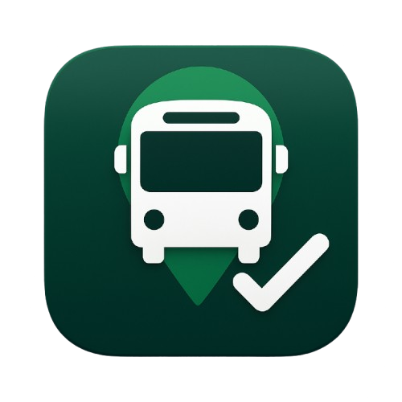

# CUETBus Flutter App

  


CUETBus is a comprehensive mobile application designed to help **CUET students** manage their transportation efficiently. The app provides real-time bus tracking, digital pass management, booking confirmations, and various other features to enhance the campus commuting experience. With a sleek design and support for **dark/light mode**, CUETBus ensures an intuitive and user-friendly experience.

---

## 📱 Features

- **Authentication**
  - Login
  - Sign Up
  - Forgot Password
  - Change Password
  - Delete Account

- **Bus Booking & Management**
  - Seat Selection
  - Booking Confirmation
  - Booking Details
  - Digital Pass
  - Bus List
  - Bus Schedule
  - Bus Details

- **User Profile & Settings**
  - Profile Management
  - Dark/Light Mode
  - Settings

- **Communication & Notifications**
  - Real-time Notifications
  - Help & Support
  - Privacy Policy
  - Terms and Conditions
  - Service Updates

- **Campus Features**
  - Home Dashboard
  - Lost and Found
  - Safety Tips

---

## 🛠 Installation

1. Clone the repository:  
```bash
git clone https://github.com/<your-username>/cuetbus_flutter.git
